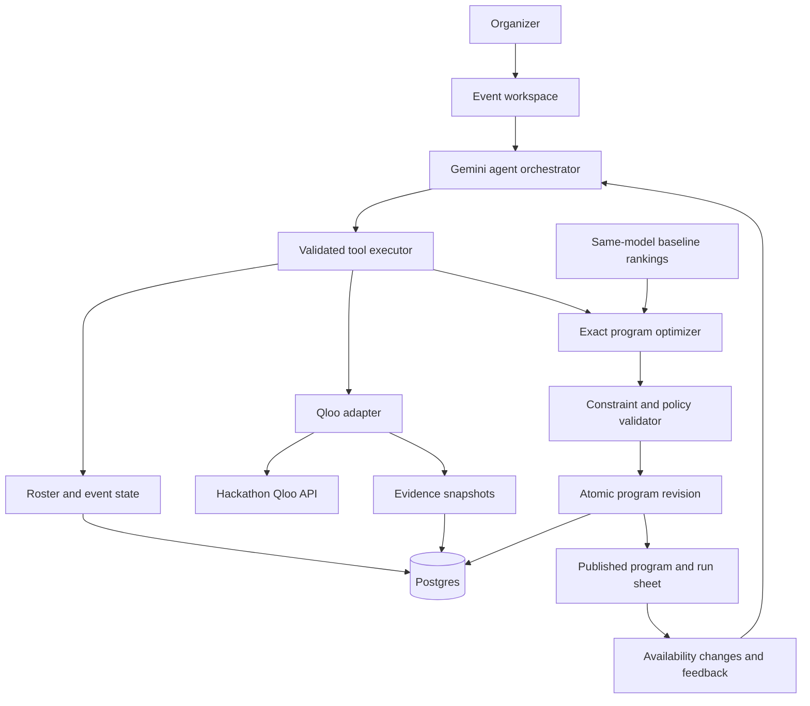

# Understudy: an agent that repairs event programs without losing their cultural intent

## 1. Decision and planning assumptions

**Build Understudy.** When a performer cancels, the agent chooses a replacement program from an organizer’s available roster, balances several audience taste profiles, checks operational constraints, and publishes a revised event program. If availability changes again, it replans.

The central question is: **“Which feasible replacement best preserves what different parts of this audience came for?”**

This follows [ideation.md](/Users/sneax/Desktop/Qloo/ideation.md). The selection considered more than 30 concepts internally, narrowed them to ten, and retained the seven below.

Defaults established for the plan:

- One developer, working October 7–30, 2026.
- Gemini free tier and free hosting.
- Qloo key requested; access, quotas, expiration, and advanced features remain unverified.
- Recruit three to five relevant testers.
- Initial product supports one affected performance slot, three audience cohorts, and up to twenty replacement acts.
- Booking availability and fees come from the organizer’s roster. Qloo supplies cultural evidence.
- The agent updates its event workspace and produces a shareable program and run sheet. Actual artist contracting and payments are outside v1.

Submit by **October 30 at 6 p.m. IST**, ahead of the official October 31, 9:15 a.m. IST deadline. Keep the demo available through **November 17, 10:15 a.m. IST**, covering the judging period. [Official rules](https://qloo.devpost.com/rules)

The scores below are strategic assessments, not measured results or probabilities of winning. Novelty has not been established against every competing submission.

## 2. The seven finalists

### Scoring

Each dimension uses a 1–10 scale.

**WIN SCORE** = 18% Qloo dependency + 15% demo + 14% originality + 12% memorability + 12% agentic depth + 8% usefulness + 8% feasibility + 6% technical sophistication + 4% defensibility + 3% startup potential.

| Project | Originality | Qloo | Agent | Demo | Technical | Useful | Feasible | Startup | Memorable | Defensible | WIN |
|---|---:|---:|---:|---:|---:|---:|---:|---:|---:|---:|---:|
| **Understudy** | 9 | 9 | 9 | 9 | 9 | 8 | 8 | 7 | 9 | 6 | **8.66** |
| **Relay** | 8 | 9 | 9 | 8 | 9 | 9 | 9 | 8 | 8 | 7 | **8.48** |
| **CommonFund** | 9 | 9 | 8 | 8 | 9 | 8 | 8 | 6 | 8 | 6 | **8.24** |
| Crossfade | 7 | 9 | 8 | 8 | 8 | 8 | 9 | 7 | 8 | 6 | 8.01 |
| Sidecar | 8 | 9 | 8 | 8 | 8 | 8 | 7 | 8 | 8 | 5 | 7.98 |
| LaunchLens | 6 | 9 | 8 | 9 | 8 | 8 | 6 | 8 | 8 | 5 | 7.77 |
| Backchannel | 7 | 9 | 8 | 7 | 8 | 8 | 7 | 8 | 7 | 5 | 7.57 |

### Mechanism and adversarial review

| Project | Decision changed by Qloo | LLM-only versus Qloo | Strongest rejection argument |
|---|---|---|---|
| **Understudy** | Choose one replacement or a complementary pair, then repair the event program. | The LLM estimates cultural fit; Qloo provides cohort-specific rankings that change the feasible program selected. | Small venues’ bookable artists may have weak graph coverage. |
| **Relay** | Allocate scarce replacement books across several disrupted subscription orders. | The LLM suggests substitutes; Qloo supplies cross-category fit while the allocator decides who receives limited stock. | Could become an ordinary book recommender unless allocation is central. |
| **CommonFund** | Allocate a community arts center’s screening budget across several declared interest groups. | The LLM proposes a program; Qloo changes which groups different films serve and the resulting allocation. | Cultural affinity is an imperfect proxy for what a community wants. |
| **Crossfade** | Repair an independent cinema’s schedule when a film becomes unavailable. | Qloo changes substitutions and scheduling priorities across audience groups. | Schedule optimization may overshadow the cultural contribution. |
| **Sidecar** | Select a merchant collaboration and divide a shared activation budget. | Qloo identifies cultural alignment across business audiences beyond superficial brand similarity. | Local merchants may be absent from Qloo; audience inputs may be speculative. |
| **LaunchLens** | Choose a pop-up neighborhood and partner shortlist. | Qloo geographic affinities change the proposed location and partnerships. | Close to a generic marketing assistant; market coverage and venue facts are additional dependencies. |
| **Backchannel** | Allocate a creator collective’s available sponsorship slots across brands. | Qloo changes creator–brand assignments using declared audience interests. | Reliable creator audience evidence is difficult to obtain; matching is an established category. |

**LaunchLens falls below my earlier recommendation** because your brief places stronger penalties on familiar marketing workflows and unverified data dependencies.

Audience-aware music booking already exists: Viberate offers artist discovery, audience analytics, and event intelligence. Understudy’s proposed distinction is the complete cancellation-recovery workflow, shared audience constraints, exact program comparison, and executed revision. It should not claim to have invented audience-aware booking. [Viberate capabilities](https://www.viberate.com/)

## 3. Deeper review of the top three

### Understudy

**Product and interaction — A/B**

For independent promoters and venue programmers handling disrupted events.

Example request:

> “Our headliner canceled. Fill the 80-minute slot from this roster. Keep the replacement within budget and avoid leaving any of these three audience groups poorly served.”

The organizer supplies available acts, quoted fees, durations, equipment requirements, and three sets of public cultural references.

**Architecture and workflow — C/G**

Cancellation → agent reads event and roster → resolves references → queries Qloo for each cohort → evaluates feasible programs → validates the selected program → publishes a revision → observes another change → replans.

**Qloo integration and dependency — D/E/F**

Resolve public artists, films, and brands; use their IDs as signals when ranking the available artist shortlist. Investigate entity search, constrained Insights ranking, and native explainability.

An LLM can recognize genre similarities. It lacks reliable, current rankings for several mixed cultural profiles over a specific roster. With Qloo, a complementary pair can displace the familiar single substitute. That improvement remains a hypothesis until tested.

**Other APIs and interface — H/I**

Qloo, Gemini, and the application’s roster/state tools are sufficient. Show the original program, audience-by-candidate matrix, feasible alternatives, revised schedule, and decision evidence.

**Demo — J**

Cancel the headliner, watch a two-act solution replace the baseline’s single act, then remove one selected act and watch the program repair itself.

**Versions and exclusions — K/L/M/N**

- Seven days: live cultural ranking, one cancellation, valid program, published revision.
- Fourteen days: second disruption, cost-versus-fit frontier, roster import, baseline comparison.
- Twenty days: reproducible evaluation cases, provenance, recovery tests, and audited revisions.
- Exclude ticket sales, artist outreach, payments, streaming music, and worldwide artist discovery.

**Risks, first experiment, and pivot — O/P/Q**

Resolve eight plausible replacement acts and two contrasting audience profiles, then rank the same roster for both. Check whether their ordering differs meaningfully.

If artist coverage fails, keep the recovery mechanism and switch to licensed film screening programs. Missing explainability alone does not kill the idea.

**Business and judge objections — R/S/T**

Potential product: contingency planning integrated into a promoter’s existing programming workflow.

The main objections are hypothetical availability, limited artist coverage, and an optimization layer built on uncertain preferences. Address them with clearly sourced organizer inputs, an importable roster, independent reviewer evaluation, and precise limits on what the cultural index means.

### Relay

**Product and interaction — A/B**

For small curated book subscription businesses.

> “These books are unavailable. Repair these orders using our remaining stock, preserving each box’s cultural brief and respecting inventory.”

The user supplies stock, prices, language/edition requirements, and anonymous cultural references for each order.

**Architecture and workflow — C/G**

Stockout → agent reads affected orders → resolves available books → obtains Qloo rankings → allocates scarce stock jointly → validates inventory → creates revised packing lists → replans when stock changes.

**Qloo integration and dependency — D/E/F**

Use ISBN lookup where supported, book entities, film/music/game input signals, and shortlist ranking. Qloo determines cultural fit; the allocator handles stock.

The important difference is joint allocation: assigning the strongest shared substitute to one order changes what the agent must choose for another. The LLM-only baseline supplies its own fit rankings to the same allocator.

**Other APIs and interface — H/I**

Google Books can help validate edition metadata; the retailer’s CSV supplies stock. Display disrupted orders, remaining stock, allocation flows, and packing-list changes. [Google Books API](https://developers.google.com/books/docs/v1/using)

**Demo — J**

Two orders initially compete for the same scarce book. The agent chooses a culturally justified allocation, produces packing lists, and repairs them after another stock change.

**Versions and exclusions — K/L/M/N**

- Seven days: three orders, fifteen books, one stockout, packing CSV.
- Fourteen days: multi-order allocation, edition checks, counterfactual stock changes.
- Twenty days: reviewer dataset and inventory conflict handling.
- Exclude checkout, shipping labels, storefront integrations, and account management.

**Risks, first experiment, and pivot — O/P/Q**

Test fifteen ISBNs and cross-domain ranking before building the allocator. Work-level versus edition-level identity is a concrete risk.

If edition matching is weak, keep edition constraints in the retailer’s inventory and use Qloo only for validated work-level cultural fit. If book coverage remains inadequate, reject the concept.

**Business and judge objections — R/S/T**

Stronger recurring commercial use than Understudy, but less immediately dramatic. Judges may see recommendations with an inventory wrapper. Make the allocation conflict, committed packing changes, and measured preference preservation the core demonstration.

### CommonFund

**Product and interaction — A/B**

For private community arts centers planning a shared screening program.

> “Use this budget to create four screenings from our licensed catalog. Each of these three interest groups should have something suitable.”

Groups explicitly supply cultural references. The system does not infer community identities.

**Architecture and workflow — C/G**

Read budget and licensed catalog → query cohort-specific film rankings → generate program alternatives → negotiate declared fit thresholds → publish the selected calendar → revise after feedback.

**Qloo integration and dependency — D/E/F**

Use movie shortlist ranking with music, book, and film signals. Use taste tags to describe differences where useful.

Qloo changes which films contribute to each group’s fit. An LLM-only system guesses that matrix; both versions use identical scheduling and budget logic.

**Other APIs and interface — H/I**

No additional external API is necessary. Produce a calendar and show a budget allocation chart, cohort fit matrix, and alternatives frontier.

**Demo — J**

An average-fit program leaves one group poorly served. The agent selects a more balanced program; changing the budget reveals the minimum affordable plan meeting all declared thresholds.

**Versions and exclusions — K/L/M/N**

- Seven days: three groups, twelve licensed films, four screening choices.
- Fourteen days: threshold negotiation and calendar generation.
- Twenty days: participant review and explanation of allocation tradeoffs.
- Exclude public funding decisions, demographic inference, voting infrastructure, and attendance forecasts.

**Risks, first experiment, and pivot — O/P/Q**

Check whether contrasting declared interests produce distinct film rankings and whether the catalog contains a balanced feasible program.

If rankings are weak, narrow to an adult film club with directly supplied film references. Actual participant feedback remains the acceptance criterion.

**Business and judge objections — R/S/T**

Useful as a programming tool, but institutional adoption is slower. Judges may object that an algorithm is defining fairness. Define fairness only as the operator’s explicit, inspectable policy; preserve participant control.

### Why Understudy wins this comparison

Understudy has the strongest combination of an understandable trigger, consequential decision, visible action, and second disruption within two minutes.

Relay has better recurring commerce potential and easier inventory mechanics, but needs more explanation to escape the familiar recommender category. CommonFund offers strong allocation depth, but its representation and fairness story requires careful qualification.

Understudy’s advantage is its demo and workflow. Its artist-coverage risk is real, which is why the first three days are a gate.

## 4. Winning product identity

### Name

Five candidates: **Understudy**, Recast, Backline, Stand-In, SecondStage.

Select **Understudy**. It communicates replacement and performance continuity immediately. Domain availability is not assumed.

### One-sentence pitch

**Understudy repairs canceled event programs by finding feasible replacements that preserve the audience’s cultural intent.**

### Thirty-second pitch

> “When a headliner cancels, organizers need more than a list of similar artists. They need an available, affordable program that still works for the different people coming. Understudy uses Qloo to compare cultural fit across those groups, checks every feasible replacement program, and publishes a revised schedule. Change availability again, and it replans. Every choice comes with its evidence, constraints, and tradeoffs.”

### Core insight

The closest replacement for one performer may be the wrong replacement for the audience as a whole.

A pair of acts can preserve different parts of the original event’s appeal better than one obvious substitute. Cultural fit and operational feasibility must therefore be evaluated jointly.

### Strongest user story

A promoter has one affected slot, a finite available roster, and three declared audience cohorts. They need a revised program quickly.

The agent finds a valid program, explains which cohort each act serves, publishes the run sheet, and repairs the plan when a selected act becomes unavailable.

The demonstration uses real public cultural entities and Qloo results. Its event, availability, and fee fixtures are visibly labeled as a demonstration scenario.

## 5. System architecture and interfaces

### Architecture

Use one model-controlled agent with typed tools, a deterministic optimizer, and a separate action validator.

The optimizer determines the best program under the declared objective. The agent manages the workflow, handles missing information, interprets tool results, and requests or executes the next permitted action.

### Agent tools

| Tool | Inputs | Outputs and purpose | Data/API |
|---|---|---|---|
| `read_event` | Event ID | Current revision, affected slot, budget, cohorts, protected acts, policy | Application database |
| `read_roster` | Event ID | Versioned offers, availability, fees, durations, equipment requirements | Organizer roster |
| `resolve_entities` | Public names and expected types | Candidate IDs, confirmed matches, unresolved choices | Qloo search |
| `rank_roster` | Cohort IDs and pool version | Rankings, raw returned scores, coverage, source status, evidence IDs | Qloo Insights |
| `optimize_program` | Event and matrix versions | Best program, alternatives, frontier, infeasibility reasons | Deterministic solver |
| `validate_revision` | Proposal ID | Budget, timing, availability, equipment, freshness, and policy checks | Database and validator |
| `apply_revision` | Proposal ID, expected revision, idempotency key | Committed revision and generated artifacts | Database transaction |
| `observe_changes` | Event ID and previous version | Changed offers, constraints, and feedback | Application state |

Resolution requiring human confirmation pauses the run. It does not silently select an ambiguous artist.

### Qloo’s role

The initial integration needs two fundamental capabilities:

1. Resolve cultural references and roster acts into validated IDs.
2. Rank supplied artist candidates for each declared cohort.

Use `/search` for resolution and investigate `/entities` when an external identifier is available. [Entity search](https://github.com/qloo/docs-public/blob/main/reference/get-search.md), [identifier lookup](https://github.com/qloo/docs-public/blob/main/reference/get-entities.md)

For ranking, test `/v2/insights` using:

- `filter.type=urn:entity:artist`
- `signal.interests.entities` for each cohort’s public cultural references
- `filter.results.entities` for the shared roster
- `take=50`

The shortlist restriction is documented, but its behavior with the event key must be checked. [Parameter reference](https://github.com/qloo/docs-public/blob/main/reference/parameters.md)

Request `feature.explainability=true` only after verifying support. Retain returned attribution and warnings; explanations may be unavailable even when recommendations succeed. [Insights deep dive](https://github.com/qloo/docs-public/blob/main/reference/insights-api-deep-dive.md)

Do not make heatmaps, historical trends, demographics, or audience-comparison endpoints critical dependencies. Their additional data and access requirements would weaken the first version’s feasibility.

All requests use the hackathon base URL. Credentials remain on the server. Only public cultural references reach Qloo; organizer identifiers and operational records remain within the application.

### Public application interfaces

- `POST /api/scenarios`: create an isolated demo workspace or import a roster.
- `PATCH /api/scenarios/:id`: change constraints or availability with an expected version.
- `POST /api/scenarios/:id/runs`: start a Qloo or baseline run; stream structured progress.
- `GET /api/runs/:id`: recover persisted status after refresh or interruption.
- `GET /programs/:revisionId`: read an explicitly published revision.
- `POST /api/runs/:id/feedback`: record reviewer preference or operator feedback.

Runs expose `running`, `needs_input`, `proposed`, `applied`, `infeasible`, `error`, or `interrupted`.

Progress contains tool activity, source status, validation results, and concise decision explanations. It does not expose hidden model reasoning.

## 6. Data and decision algorithm

### Necessary storage

| Table | Contents |
|---|---|
| `scenarios` | Owner session hash, event configuration, cohorts, policy, current revision |
| `candidates` | Qloo ID, offer fee, duration, availability window, equipment, source, expiration |
| `evidence` | Canonical query hash, sanitized results, retrieval time, expiration, provenance |
| `runs` | Trigger, model version, tool trace, evidence references, matrix, proposal, status |
| `revisions` | Parent revision, applied program, originating run, generated artifacts |
| `feedback` | Anonymous reviewer role, blinded comparison, preference, comments |

No user-account system is required. Audience profiles belong to their event workspace.

Use integer monetary units and a single currency per event. Each offer records whether it came from an organizer or a synthetic demonstration fixture.

### Cultural fit calculation

Raw Qloo affinity scores are contextual and normalized per query. They must not be averaged across different requests as if they were comparable probabilities. [Score interpretation](https://github.com/qloo/docs-public/blob/main/docs/interpreting-affinity-scores.md)

Instead:

1. Query the same candidate pool for every cohort.
2. Retain the common subset ranked for every cohort.
3. Display excluded or unresolved candidates.
4. Convert each cohort’s ordering into an ordinal index.

For a pool of \(N\) entities and candidate rank \(r_{gc}\):

\[
q_{gc}=\frac{N-r_{gc}}{N-1}
\]

Tied returned scores receive the same midrank. If fewer than two comparable candidates remain, report insufficient comparative evidence.

For replacement program \(S\):

\[
U_g(S)=\max_{c\in S}q_{gc}
\]

This represents the strongest available match within the program for cohort \(g\). It is an explicit modeling assumption, not predicted attendance or satisfaction.

### Hard constraints

A valid program must:

- Include one or two replacement acts.
- Fit the affected slot, including changeover time.
- Meet the organizer’s minimum performance duration.
- Stay within the replacement budget.
- Use currently available, unexpired offers.
- Meet the venue’s equipment requirements.
- Respect protected acts and unaffected slots.
- Use candidates with sufficient cultural evidence.

Default audience-fit floor: **0.50**, adjustable by the organizer and labeled as a relative ranking threshold.

### Optimization objective

Among programs satisfying all constraints and declared cohort floors, optimize lexicographically:

1. Highest worst-cohort fit.
2. Highest weighted mean cohort fit.
3. Fewest changes from the current replacement program.
4. Lowest cost.
5. Stable canonical-ID tie-break.

Cohort weights default to equal. They represent organizer priorities, not inferred population shares.

With twenty candidates, there are at most **400 ordered one- or two-act programs**. Enumerate them exactly; an additional optimization framework is unnecessary.

### Technical feature

**A verifiable cost-versus-fit frontier with automatic replanning.**

For every nondominated program, show its cost and worst-cohort index. Calculate the minimum budget needed to meet a chosen fit floor using the available roster.

This lets the agent explain:

> “No program meets your threshold within this budget. Here is the least expensive feasible alternative, and the exact constraint preventing it.”

That statement is derived from the available offers and algorithm. It makes no claim about audience size or commercial success.

## 7. Agent execution and action policy

A normal run follows this sequence:

1. Read the cancellation, current program, and authorized policy.
2. Read the latest roster and offer versions.
3. Resolve or confirm any new cultural references.
4. Obtain or reuse provenance-bearing Qloo rankings for each cohort.
5. Build the common comparison pool.
6. Enumerate valid replacement programs and choose the optimum.
7. Independently validate the proposal.
8. Apply it if the organizer has enabled automatic workspace updates.
9. Generate the revised program, run sheet, and change summary.
10. Observe a subsequent availability or constraint change and repeat.

The agent cannot silently relax budgets, alter protected acts, or reduce audience-fit floors. If no valid program exists, it returns concrete relaxation options.

Before applying, recheck event version, roster version, quote expiration, and availability. Apply the revision atomically with an idempotency key.

“Applied” means the event workspace changed. It does not mean performers were contracted or money was spent.

## 8. Product experience and two-minute demo

### Important screens

| Screen | Essential behavior |
|---|---|
| **Start** | Open the reference scenario or create an isolated workspace |
| **Event brief** | Set slot, budget, roster, declared cohorts, and action policy |
| **Recovery workspace** | See the original program, disruption, agent activity, and proposal |
| **Cultural evidence** | Inspect candidate-by-cohort rankings and their provenance |
| **Tradeoffs** | Explore the cost-versus-fit frontier and infeasibility boundaries |
| **Published revision** | View the new program, run sheet, changes, and decision history |
| **Evaluation** | Compare blinded reviewer results and operational validity |

Use an operations-board layout. The program and evidence are the main interface; natural-language instructions are a supporting control.

### Main visualization

A **candidate-by-cohort matrix linked to the program frontier**.

Selecting an act highlights its cohort rankings. Selecting a pair highlights the strongest match for each cohort. Changing budget, availability, or fit floor updates the feasible frontier and selected program.

Native input attribution appears only where Qloo actually returned it.

### Exact demo script

The final scenario must come from observed Qloo results and validation work. Do not invent rankings to obtain this sequence.

| Time | Action |
|---|---|
| **0:00–0:15** | Show the event, three declared audience cohorts, budget, and available roster. Trigger the headliner cancellation. |
| **0:15–0:30** | Show the same-model baseline’s valid proposal and its supplied cultural rankings. |
| **0:30–0:45** | Start Understudy. Show Qloo evidence arriving or a clearly identified fresh cache being reused. |
| **0:45–1:00** | Highlight how cohort rankings differ. Inspect the selected replacement program. |
| **1:00–1:15** | Show the frontier and the operational checks behind the choice. |
| **1:15–1:30** | The agent applies the revision. Open the generated program and run sheet. |
| **1:30–1:45** | Make one selected act unavailable. Watch the agent replan against the new roster version. |
| **1:45–2:00** | Show the revised artifact and measured pilot findings, including limitations and any baseline wins. |

The memorable moment is a cultural conflict visibly changing a program, followed by a real persisted revision.

## 9. Fair baseline, evaluation, and acceptance tests

### LLM-only baseline

Both versions receive:

- The same model and comparable inference budget.
- Identical audience references and candidate metadata.
- Identical available offers and operational constraints.
- The same optimizer, validator, and action tools.

The baseline model produces cohort-specific candidate orderings. The Qloo version obtains those orderings from Qloo. Everything downstream remains the same.

This isolates the contribution of cultural evidence.

### Evaluation dataset

Build **twenty cases**:

- Five straightforward substitutions.
- Five cases with conflicting cohort preferences.
- Five cases with tight budgets or restricted availability.
- Five cases involving a second disruption or an infeasible request.

Cases use real cultural identities. Synthetic operational inputs are explicitly identified.

Use three to five reviewers, prioritizing promoters and venue programmers. Have them assess blinded, randomly ordered proposals. Collect reasons as well as preferences.

### Metrics

| Metric | What it establishes |
|---|---|
| Reviewer preference | Whether people prefer the Qloo-informed proposal |
| Cultural appropriateness | Independent assessment of the supplied brief |
| Constraint violations | Whether proposals remain operationally valid |
| Completion time | Time from disruption to usable revised artifact |
| Program churn | How much a second disruption changes the program |
| Evidence coverage | How much of the roster was actually comparable |
| Latency and API calls | Whether the live product fits available quotas |

Qloo’s own scores are diagnostic outputs, not independent proof that Qloo improved the product.

Report counts and case-level results. A small pilot does not justify broad statistical or revenue claims.

### Release targets

These are targets, not observed results:

- Zero constraint violations in the benchmark.
- No unsupported availability, pricing, attribution, or individual-preference claims.
- Majority blinded preference for the Qloo version.
- Successful second-disruption recovery.
- Typical cold recovery completes within 45 seconds.
- Constraint-only changes reuse cultural evidence when the comparison pool is unchanged.

### Meaningful automated tests

- A complementary pair beats an average-fit single act in a hand-verified fixture.
- Unavailable, expired, over-budget, or incompatible acts cannot be applied.
- Changeovers and both possible pair orders are checked.
- Missing cultural results remain unknown and do not receive invented scores.
- A stale event version prevents application.
- Repeated requests with one idempotency key produce one revision.
- Failure between proposal and application leaves the previous program intact.
- Missing native explainability produces an honest explanation without fabricated attribution.
- Browser tests cover cancellation → applied revision → second cancellation → repaired revision.

## 10. Stack, external dependencies, and demo reliability

### Selected stack

| Component | Choice |
|---|---|
| Runtime | Node.js 24 LTS |
| Application | Next.js 16.3.8 App Router and TypeScript |
| UI | Tailwind CSS and shadcn/ui |
| Visualization | React-rendered SVG matrix and Recharts frontier |
| Agent | Gemini `gemini-3.8-flash`, official `@google/genai` SDK |
| Validation | Zod |
| Database | Neon Postgres with Drizzle |
| Hosting | Vercel Hobby for the personal, noncommercial hackathon demo |
| Identity | Signed anonymous workspace cookie |
| Qloo | Thin server-side REST adapter |
| Tests | Vitest and Playwright |

The current official docs list Next.js 16.3.8 and Gemini 3.8 Flash. Gemini supports function calling and a limited free tier. [Next.js installation](https://nextjs.org/docs/app/getting-started/installation), [Gemini models](https://ai.google.dev/gemini-api/docs/models), [function calling](https://ai.google.dev/gemini-api/docs/function-calling), [pricing](https://ai.google.dev/gemini-api/docs/pricing)

Vercel Hobby is restricted to personal, noncommercial use. Neon has a free database tier. A commercial launch would require revisiting hosting. [Vercel Hobby](https://vercel.com/docs/plans/hobby), [Neon free plan](https://neon.com/blog/neon-free-plan-1-gb-per-project)

Use direct Qloo HTTP requests in the deployed backend. Keep the harness for local exploration; its MCP starter does not support serverless deployment. [Qloo MCP deployment guidance](https://github.com/qloo/qloo-hackathon-kit/tree/main/starter/mcp-client)

### Other APIs

The winning MVP needs no artist-booking, ticketing, maps, calendar, or streaming API.

The organizer’s versioned roster is the operational source of truth. Adding another public metadata API would not establish real booking availability.

### Reliability and quota controls

- Maximum six model turns per recovery run.
- One active run per workspace.
- Cached entity resolution and cohort ranking evidence.
- Bounded retries for retryable errors, respecting returned retry timing.
- Account-specific Qloo and Gemini quotas established during setup.
- Evidence records contain source, retrieval time, mode, and warnings.
- Persist tool results and proposal status so refreshes do not restart completed work.
- Record errors and quota use without logging credentials.

Qloo’s event guidance requires minimal requests, bounded retries, and explicit authentication/rate-limit errors. [Access guidance](https://github.com/qloo/qloo-hackathon-kit/blob/main/docs/API_ACCESS.md)

### Failure during judging

Provide distinct modes:

1. **Live:** current API calls or explicitly identified fresh cached evidence.
2. **Recorded reference run:** replay a previously captured, labeled tool trace.
3. **Degraded operation:** apply new operational constraints to available cached evidence with the deterministic planner, clearly stating that no fresh model or Qloo call occurred.

Recorded playback is a backup demonstration. It does not replace the functional public application required for submission.

## 11. First experiments and 24-day delivery plan

### First 24 hours: October 7

1. Install Node and the supported Qloo harness; obtain a separate Gemini key.
2. When the Qloo key arrives, point both harness base URLs at `https://hackathon.api.qloo.com`.
3. Check authentication, quota, rate limits, expiration, and allowed evidence retention.
4. Resolve eight potential roster acts and two contrasting cultural profiles.
5. Rank the same artist shortlist for both profiles.
6. Test `filter.results.entities` and complete result coverage.
7. Test native explainability independently.
8. Build a small, hand-checkable optimizer using those rankings.
9. Compare its result with rankings supplied by the same Gemini model.
10. Invite the first relevant reviewers and show them the proposed workflow.

If the key has not arrived, prepare the roster, optimizer fixtures, and interface skeleton. Do not describe fixture rankings as Qloo results.

### Days 1–3: viability gates

Continue with the artist version only if:

- At least 80% of sampled roster acts resolve confidently.
- At least eight artists form a usable comparison pool.
- Contrasting cohorts produce meaningful ordering differences.
- The constrained-ranking response supports reproducible comparison.
- At least one joint program decision depends materially on cultural rankings.
- Early reviewers recognize the operational problem and can assess the proposals.

Also test whether film or brand references add useful information beyond artist-only inputs. If they do not, remove the cross-domain claim.

**Pivot rules:**

- Artist coverage fails: move Understudy to licensed film screening recovery, using the same program-repair mechanism.
- Native explainability fails: retain returned rankings, provenance, operational explanations, and labeled counterfactual comparisons.
- Neither artist nor film shortlist ranking works: reject this mechanism.
- Independent review shows no cultural advantage: revise the approach before adding polish.
- Event access cannot support judging: resolve it with the organizers; replay alone is insufficient.

### Development milestones

| Days | Dates | Deliverable and acceptance |
|---|---|---|
| **1–3** | Oct 7–9 | Verified Qloo requests, coverage report, optimizer spike, explicit continue/pivot decision |
| **4–7** | Oct 10–13 | Public MVP: isolated workspace, cancellation, ranking, valid program, persisted revision, run sheet |
| **8–12** | Oct 14–18 | Roster import, second disruption, frontier, matched baseline, first blinded reviews |
| **13–17** | Oct 19–23 | Twenty-case benchmark, provenance, action validation, interruption and conflict recovery |
| **18–20** | Oct 24–26 | Complete visual story, measured findings, reference run, targeted fixes |
| **21–22** | Oct 27–28 | Fresh-environment setup test, public demo checks, repository/license/README, submission draft |
| **23–24** | Oct 29–30 | Feature freeze, rehearsal, final reliability checks, submit by Oct 30 at 6 p.m. IST |

**Critical path:** key → shortlist ranking → roster coverage → cultural decision difference → valid revision → independent evaluation → public deployment.

Maintain the demo and its required credentials through judging. Monitor authentication errors, quota exhaustion, failed runs, application conflicts, and completion latency.

## 12. Submission materials and judge defense

### README structure

1. Problem and one-sentence pitch.
2. Live demo and a one-minute walkthrough.
3. Reference cancellation scenario.
4. What the agent changes and applies.
5. Qloo requests and redacted evidence.
6. Architecture and decision objective.
7. Matched baseline and evaluation results.
8. Synthetic operational inputs and other limitations.
9. Local setup and environment variables.
10. Tests, license, and acknowledgments.

Include an MIT license and complete setup instructions. The submission needs a public working demo, public source repository, and product description. The kit additionally asks for workflow choices and a redacted request-to-result explanation. [Hackathon requirements](https://qloo.devpost.com/), [submission guide](https://github.com/qloo/qloo-hackathon-kit/blob/main/docs/SUBMISSION.md)

### Submission description draft

> **Understudy repairs canceled event programs while preserving their cultural intent.**
>
> An organizer supplies an available roster, operational constraints, and anonymous cultural references for different audience groups. Understudy uses Qloo to rank that roster for each group, evaluates feasible replacement programs, and publishes a revised program with a run sheet and evidence.
>
> When availability changes, the agent replans against the new constraints. An interactive frontier shows the tradeoff between cost and the weakest-served cohort.
>
> The project compares Qloo-informed and same-model baseline decisions using identical operational inputs and independent reviewer feedback. Demonstration availability and fees are explicitly labeled, and the system does not claim to predict attendance or complete artist bookings.

Add actual evaluation findings only after collecting them.

### Ten hardest judge questions

| Question | Credible answer |
|---|---|
| **Could ChatGPT do this?** | It can estimate rankings. Our matched baseline tests whether Qloo improves those rankings enough to change independently preferred programs. |
| **Is this a recommendation system?** | Cultural ranking is one input. The product repairs a constrained program, validates it, applies a revision, generates artifacts, and handles another disruption. |
| **Are these artists actually available?** | Availability comes from imported organizer offers. The reference scenario uses labeled synthetic offers. |
| **Does Qloo predict attendance?** | No. We use aggregate cultural relationships and an explicit ordinal fit proxy. |
| **Why should I trust the fairness calculation?** | It implements a declared floor and objective that the organizer can inspect and change. It does not establish broader social fairness. |
| **What is actually autonomous?** | Reading state, invoking tools, evaluating alternatives, applying authorized workspace changes, producing artifacts, and replanning. |
| **What if Qloo misses an artist?** | The omission is visible. Unknown candidates do not receive fabricated scores or enter a supposedly verified optimum. |
| **How did you prove improvement?** | Identical constraints and downstream algorithms, blinded comparisons, reviewer reasons, and disclosed baseline wins. |
| **What prevents unsafe application?** | Independent validation, version checks, unexpired offers, protected acts, idempotency, and atomic revision writes. |
| **What is defensible?** | The eventual value is integration with programming operations and an outcome-labeled failure corpus. The initial interface and API access are readily reproducible. |

### Strongest Qloo defense

**Qloo supplies the cultural ordering on which the decision depends.** The optimizer cannot recover that information from prices, availability, durations, or generic category labels.

The defense becomes credible only when the matched experiment shows a benefit. Heavy API usage alone is not evidence.

### Final priorities

Spend the most time on:

1. Proving coverage and useful ranking differences.
2. Showing that those differences improve independent judgments.
3. Making the applied revision and second recovery unmistakable.
4. Building correct constraints, provenance, and failure handling.
5. Producing a fast, coherent public demo.

Do not spend time on:

1. Multiple model agents without a demonstrated benefit.
2. Worldwide artist search or booking marketplaces.
3. Payments, ticketing, outreach, or OAuth integrations.
4. Attendance and revenue forecasts.
5. Adding Qloo endpoints merely to increase the integration count.

**The winning demonstration should show cultural evidence changing an operational decision, a valid program being applied, and the agent repairing it again under new constraints.**
